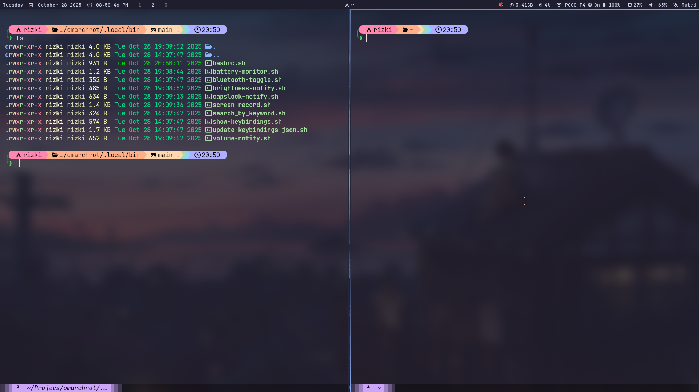

# Omarchrot

> Clean. No clutter. Everything you need, nothing you don't.

A **minimal aesthetics** Hyprland dotfiles collection for Arch Linux. This is a personal configuration focused on **simplicity, beauty, and productivity** — stripped down to essentials, refined for daily use.

_Note: The name has no relation to [Omarchy](https://github.com/basecamp/omarchy) — it was chosen randomly._

## Preview





**Philosophy**: Every element serves a purpose. No unnecessary widgets, no distracting animations, no visual noise. Just a clean, functional workspace that gets out of your way.

## Core Stack

| Component         | Choice          | Why                                             |
| ----------------- | --------------- | ----------------------------------------------- |
| **WM**            | Hyprland        | Smooth Wayland compositor, minimal yet powerful |
| **Bar**           | Waybar          | Clean, customizable, no bloat                   |
| **Launcher**      | Tofi            | Fast, minimal, keyboard-driven                  |
| **Terminal**      | Kitty           | GPU-accelerated, clean aesthetics               |
| **Shell**         | Bash + Starship | Simple, fast, beautiful prompt                  |
| **Notifications** | Dunst           | Unobtrusive, scriptable OSD                     |
| **Editor**        | Neovim          | Efficient, distraction-free coding              |
| **File Manager**  | PCManFM         | Lightweight, GTK-based                          |
| **Browser**       | Firefox         | Customizable, privacy-focused                   |
| **Notes**         | Obsidian        | Markdown-based knowledge management             |

## What's Included

### Minimalist Design Principles

- **Modular Configuration**: Split Hyprland configs for easy customization
- **Consistent Aesthetics**: Cohesive color scheme and typography across all components
- **Intelligent Defaults**: Sane settings that work out of the box
- **No Bloat**: Every package and script serves a clear purpose

### Custom Utilities

All scripts live in `.local/bin/` and follow consistent patterns:

**Visual Feedback** (minimal, non-intrusive):

- `volume-notify.sh` - Volume OSD with ASCII bar graph
- `brightness-notify.sh` - Brightness OSD with visual indicator
- `capslock-notify.sh` - Subtle caps lock notification
- `battery-monitor.sh` - Smart battery warnings with auto-dimming (systemd timer)

**System Controls**:

- `bluetooth-toggle.sh` - One-key bluetooth toggle
- `screen-record.sh` - Hardware-accelerated screen recording (NVIDIA/AMD auto-detect)

**Workflow Enhancements**:

- `show-keybindings.sh` - Interactive keybinding reference (SUPER+K)
- `update-keybindings-json.sh` - Auto-sync keybindings from config

### What You Won't Find

- Unnecessary animations or eye candy
- Dozens of unused applications
- Complicated setup procedures
- Cluttered status bars
- Distracting widgets

## Installation

**Requirements**: Fresh Arch Linux installation with base-devel and git installed.

```bash
# Clone the repository
git clone https://github.com/rizukirr/omarchrot.git
cd omarchrot

# Run the automated installer
./install.sh
```

The installer handles everything:

- AUR helper detection/installation (yay/paru)
- Git submodule initialization (Neovim config from [rrxxyz/nvim-minimal](https://github.com/rrxxyz/nvim-minimal))
- Package installation from curated lists
- Symlink creation with automatic backups
- Service enablement (PipeWire, battery monitor)
- Keybinding JSON generation

**Post-install**: Customize machine-specific configs:

- `~/.config/hypr/monitors.conf` - Display configuration
- `~/.config/hypr/hyprpaper.conf` - Wallpaper path

Then log out and select Hyprland from your display manager.

## Keybindings

**Pro tip**: Press `SUPER + K` for an interactive keybinding reference with fuzzy search.

### Essential Shortcuts

| Binding               | Action                 | Category |
| --------------------- | ---------------------- | -------- |
| `SUPER + T`           | Terminal               | Launch   |
| `SUPER + B`           | Browser                | Launch   |
| `SUPER + A`           | App Launcher           | Launch   |
| `SUPER + F`           | File Manager           | Launch   |
| `SUPER + Q`           | Kill window            | Window   |
| `SUPER + E`           | Emoji picker           | Utility  |
| `SUPER + V`           | Clipboard history      | Utility  |
| `SUPER + M`           | Color picker           | Utility  |
| `SUPER + P`           | Screen record (output) | Media    |
| `SUPER + SHIFT + P`   | Screen record (region) | Media    |
| `Print`               | Screenshot (full)      | Media    |
| `SUPER + Print`       | Screenshot (window)    | Media    |
| `SUPER + ALT + Print` | Screenshot (area)      | Media    |
| `SUPER + SHIFT + L`   | Lock screen            | System   |
| `SUPER + ESC`         | Logout menu            | System   |

All keybindings are defined in `~/.config/hypr/binding.conf` and automatically synced to JSON for the interactive viewer.

## Customization

### Making It Yours

This config is designed to be easily customized:

**Hyprland Settings**: All configs are modular in `~/.config/hypr/`:

- `looknfeel.conf` - Animations, blur, decorations
- `binding.conf` - Keybindings (auto-synced to JSON)
- `windows.conf` - Window rules and workspace behavior
- `programs.conf` - Program paths and variables

**After modifying keybindings**:

```bash
~/.local/bin/update-keybindings-json.sh
```

**Color Scheme**: Waybar and other components use consistent theming. Modify colors in:

- `~/.config/waybar/style.css`
- `~/.config/kitty/kitty.conf`
- `~/.config/dunst/dunstrc`

### Technical Stack

- **Audio**: PipeWire + WirePlumber (modern, low-latency)
- **Screen Recording**: Hardware-accelerated (wf-recorder for NVIDIA, wl-screenrec for others)
- **Clipboard**: cliphist + wl-clipboard (Wayland-native)

## Package Philosophy

Every package is intentionally chosen. No "just in case" bloat.

### Categories

**Desktop Environment**:

- Hyprland ecosystem (compositor, wallpaper, lock, idle management)
- Waybar, Tofi, Dunst, Wlogout

**Media & Graphics**:

- PipeWire (audio), Brightnessctl (backlight)
- wf-recorder/wl-screenrec (recording), grimblast-git (screenshots)
- hyprpicker (color picker)

**Productivity**:

- Kitty (terminal), Neovim (editor)
- Firefox (browser), Obsidian (notes), PCManFM (files)

**CLI Enhancements**:

- fzf (fuzzy finder), zoxide (smart cd), Starship (prompt)
- cliphist (clipboard), jome (emoji picker)

**System**:

- Polkit-KDE (authentication), Blueman (Bluetooth)
- JetBrains Mono Nerd Font (typography)

Full lists available in `packages.txt` and `aur-packages.txt`.

## Maintenance

### Syncing Local Changes

```bash
cd ~/Projects/Tools/omarchrot
cp ~/.config/hypr/*.conf .config/hypr/
git add . && git commit -m "Update configurations" && git push
```

### Common Issues

| Problem                     | Solution                                                                             |
| --------------------------- | ------------------------------------------------------------------------------------ |
| Scripts not executing       | Add `~/.local/bin` to `$PATH`, verify permissions                                    |
| Keybinding viewer empty     | Run `~/.local/bin/update-keybindings-json.sh`                                        |
| No audio                    | Enable PipeWire: `systemctl --user enable --now pipewire pipewire-pulse wireplumber` |
| Battery monitor not running | Check systemd timer: `systemctl --user status battery-monitor.timer`                 |

### Reload Configuration

```bash
hyprctl reload  # Reload Hyprland config without restarting
```

## Notes

- **Neovim**: Separate git submodule from [rrxxyz/nvim-minimal](https://github.com/rrxxyz/nvim-minimal)
- **Monitor Config**: Machine-specific, adjust `monitors.conf` for your setup
- **GPU Support**: Screen recording auto-detects NVIDIA vs. other GPUs
- **Battery Monitor**: Runs via systemd timer (every 30 seconds) with smart threshold-based notifications

## Design Credits

This configuration prioritizes **function over form**, but when form serves function, it's refined to perfection. Inspired by the Unix philosophy: do one thing well, and compose tools together.

---

**License**: MIT - Use, modify, share freely.

**Contributions**: This is a personal config, but suggestions and improvements are welcome via issues or PRs.
