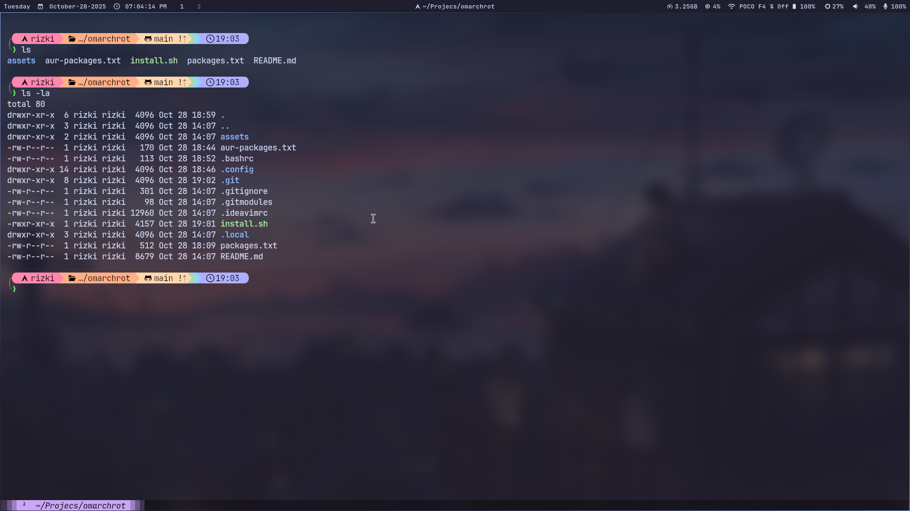

# Omarchrot

This repository is **not related** to [Omarchy](https://github.com/basecamp/omarchy) — the name was chosen randomly. It contains my personal **Hyprland dotfiles**, focused on a **minimal, productivity and clean** setup.

## 🖼️ Preview





## ⚙️ System Info

- **WM**: Hyprland
- **Bar**: Waybar
- **Launcher**: Tofi
- **Terminal**: Kitty
- **Shell**: Bash with Starship prompt
- **Notifications**: Dunst
- **File Manager**: PCManFM
- **Browser**: Firefox
- **Notes**: Obsidian
- **Editor**: Neovim
- **Bluetooth**: Blueman
- **Wifi**: Wterm

## 📦 What's Included

### Core Components

- **Hyprland** ecosystem (hyprpaper, hyprlock, hypridle, hyprpicker)
- **Waybar** - Status bar configuration
- **Tofi** - Application launcher
- **Kitty** - Terminal emulator
- **Dunst** - Notification daemon
- **Wlogout** - Logout menu

### Applications & Tools

- Firefox, Obsidian, PCManFM
- Neovim (separate repo - see below)
- Starship prompt
- Fastfetch system info
- fzf, zoxide for enhanced CLI

### Custom Scripts (in `.local/bin/`)

- `battery-monitor.sh` - Low battery notifications
- `bluetooth-send.sh` - Bluetooth file sharing (useless, too hard to make it for me)
- `bluetooth-toggle.sh` - Toggle bluetooth
- `bluetooth-rfkill-check.sh` - Bluetooth rfkill check if blocked
- `brightness-notify.sh` - Brightness OSD
- `capslock-notify.sh` - Caps lock indicator
- `screen-record.sh` - Screen recording with ffmpeg
- `show-keybindings.sh` - Interactive keybinding viewer (fzf)
- `update-keybindings-json.sh` - Auto-generate keybindings.json
- `volume-notify.sh` - Volume OSD

## 🚀 Installation

### Fresh Arch Linux Installation

1. **Clone this repository:**

   ```bash
   git clone https://github.com/rizukirr/omarchrot.git
   cd omarchrot
   ```

2. **Run the installation script:**

   ```bash
   ./install.sh
   ```

   The script will:
   - Detect/install AUR helper (yay/paru)
   - Initialize git submodules (Neovim config)
   - Install all packages from `packages.txt` and `aur-packages.txt`
   - Create symlinks for configs and scripts
   - Generate keybindings.json
   - Enable system services

3. **Customize machine-specific configs:**
   - Edit `~/.config/hypr/monitors.conf` for your display setup
   - Update `~/.config/hypr/hyprpaper.conf` with your wallpaper path

4. **Log out and log back into Hyprland**

## ⌨️ Key Bindings

Press `SUPER + K` to view all keybindings in an interactive fzf menu.

### Common Shortcuts

- `SUPER + T` - Terminal
- `SUPER + B` - Browser
- `SUPER + A` - App Launcher
- `SUPER + F` - File Manager
- `SUPER + Q` - Kill active window
- `SUPER + E` - Emoji picker
- `SUPER + V` - Clipboard history
- `SUPER + M` - Color picker
- `SUPER + P` - Screen record (output)
- `SUPER + SHIFT + P` - Screen record (region selection)
- `Print` - Screenshot (full screen)
- `SUPER + Print` - Screenshot (active window)
- `SUPER + ALT + Print` - Screenshot (area selection)
- `SUPER + SHIFT + L` - Lock screen
- `SUPER + ESC` - Logout menu

## 🔧 Customization

### Updating Keybindings JSON

After modifying `~/.config/hypr/binding.conf`:

```bash
~/.local/bin/update-keybindings-json.sh
```

### Audio/Video Backend

- **Audio**: PipeWire + WirePlumber
- **Screen Recording**: ffmpeg with NVENC hardware encoding

## 📋 Package Lists

### Official Packages

See `packages.txt` for the complete list including:

- Hyprland ecosystem
- UI tools (waybar, tofi, dunst)
- Audio/Video (pipewire, ffmpeg)
- CLI utilities (fzf, zoxide, starship, fastfetch)
- JetBrains Mono Nerd Font

### AUR Packages

- grimblast-git

## 🔄 Updating Your Dotfiles

After making changes to your local configs:

```bash
cd ~/Projects/Tools/dotfiles
# Copy updated configs back to the repo if needed
cp ~/.config/hypr/*.conf .config/hypr/
# Commit and push
git add .
git commit -m "Update configurations"
git push
```

## 🐛 Troubleshooting

**Scripts not working?**

- Ensure `~/.local/bin` is in your `$PATH`
- Check script permissions: `chmod +x ~/.local/bin/*.sh`

**Keybindings not showing?**

- Run: `~/.local/bin/update-keybindings-json.sh`

**Audio not working?**

- Enable PipeWire: `systemctl --user enable --now pipewire pipewire-pulse wireplumber`

## 📝 Notes

- Neovim config is included as a git submodule from [rrxxyz/nvim-minimal](https://github.com/rrxxyz/nvim-minimal)
- Monitor configuration may need adjustment for your hardware
- Some scripts assume NVIDIA GPU for hardware encoding (screen-record.sh)

## 📄 License

MIT License - Feel free to use and modify!
